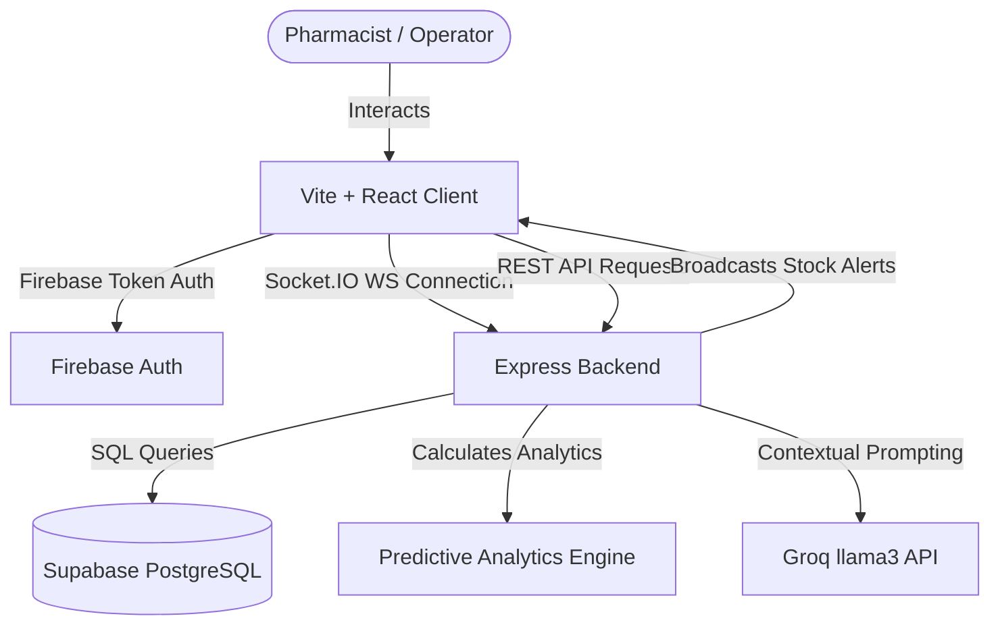

# PharmaTrack: Intelligent Pharmacy Inventory Management System 💊🚀

PharmaTrack is a real-time, multi-tenant pharmacy inventory assistant designed to eliminate drug waste, automate stock notifications, and streamline supplier communication using mathematical forecasting and generative AI. 

Built with a modern **dark-mode glassmorphic interface**, it is designed for local pharmacists, compliance inspectors, and inventory managers.

---

## 🌟 Core Features

### 1. Multi-Tenant Scoping & Security 🔒
* **Complete Isolation**: Companies register with a unique **Company Name** and **Email Address**. 
* **Data Scoping**: Every database transaction (medicines, sales, suppliers) is secured at the query level (`WHERE user_id = $1`) matching the authenticated Firebase User ID.
* **WebSocket Isolation**: Sockets automatically join company-specific rooms (`socket.emit('join_room', userId)`), ensuring real-time stock alerts are broadcast strictly to that tenant.

### 2. Interactive Point-of-Sale (POS) Checkout 🛒
* **Dynamic Catalog**: Search and browse active, in-stock medicine batches.
* **Basket Cashier**: Adjust quantities using tactile controls. Displays checkout totals dynamically.
* **Automated Safety Guard**: Prevents selling expired drugs or checking out quantities exceeding current shelf counts.
* **Daily KPIs**: Instantly calculates *Today's Revenue ($)*, *Transactions*, and *Top-Selling Medicines*.

### 3. Predictive Expiry & Restock Engine 🧠
* **Mathematical Forecasting**: Computes average daily unit sales (Sales Velocity) to predict depletion timelines.
* **Wastage Projections**: Identifies slow-selling batches and warns of potential financial losses ($) before expiry.
* **Safety Restocks**: Suggests purchase sizes using sales velocity and safety thresholds rather than arbitrary numbers.
* **Interactive Promotion Markdown**: Prompts operators to apply percentage markdown discounts to clear high-risk stock before expiration.

### 4. Visual alerts & Free WhatsApp Integration 🚨
* **Visual Timelines**: Progress bars indicating elapsed medicine shelf-life (emerald green for fresh, warning orange, and red for expired/near-expiry).
* **Multi-Channel Dispatch**:
  * **Visual Email Reports**: Compiles warning reports into clean, visual HTML documents sent to the pharmacy's email via Nodemailer SMTP (with Ethereal sandbox fallbacks).
  * **Free WhatsApp alerts**: Compiles active alerts (low stock, expired, near-expiry) into structured markdown messages and opens WhatsApp Click-to-Chat pre-filled with the pharmacy contact phone.
  * **WhatsApp Supplier PO**: Generates purchase orders and launches chats directly with supplier phone lines.

### 5. Conversational AI Assistant (PharmaBot) 🤖
* Powered by the **Groq API** (`llama-3.3-70b-versatile` / `llama-3.1-8b-instant`).
* Reads real-time scoped inventory tables, sales counts, and supplier listings to answer auditing questions (e.g. *"What needs reordering?"*, *"Analyze Amoxicillin risk"*).

---

## 📐 Technology Architecture



---

## 🛠️ Installation & Setup

### Prerequisites
* **Node.js** (v18+)
* **Supabase** (PostgreSQL Database)
* **Firebase Project** (Client Credentials)
* **Groq API Key** (For chatbot)

### 1. Database Setup
Execute the [schema.sql](file:///Users/applemac/Desktop/Pharmtrack/server/schema.sql) file in your Supabase SQL Editor. This initializes tables:
* `users` — Company credentials, license, alert settings.
* `medicines` — Medicine batches, price, quantity, expiry, and supplier details.
* `sales` — Transaction history and revenues.
* `suppliers` — Authorized manufacturer directories.

### 2. Backend Server Config
1. Navigate to `/server` directory:
   ```bash
   cd server
   npm install
   ```
2. Create a `.env` file in the `/server` folder:
   ```env
   PORT=5000
   DATABASE_URL=your_supabase_postgresql_connection_string
   GROQ_API_KEY=your_groq_api_key
   # SMTP config (optional, falls back to ethereal sandbox)
   SMTP_HOST=smtp.gmail.com
   SMTP_PORT=587
   SMTP_USER=your_email@gmail.com
   SMTP_PASS=your_email_password
   ```
3. Start the API server:
   ```bash
   npm start
   ```

### 3. Frontend Client Config
1. Navigate to `/client` directory:
   ```bash
   cd client
   npm install
   ```
2. Set up your Firebase configuration in [client/src/firebase.js](file:///Users/applemac/Desktop/Pharmtrack/client/src/firebase.js).
3. Start the client:
   ```bash
   npm run dev
   ```
4. Access the dashboard at **[http://localhost:5173](http://localhost:5173)**.

---

## 📜 License
Distributed under the MIT License. See `LICENSE` for more information.
