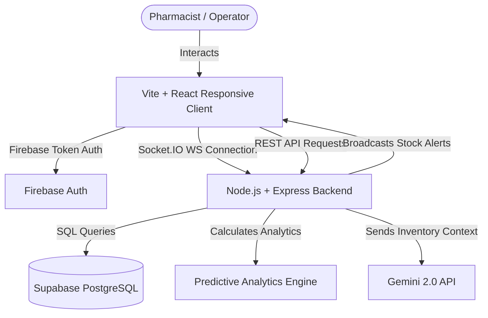

# PharmaTrack: Intelligent Pharmacy Inventory Management System
## Taskpad & System Documentation

PharmaTrack is an intelligent, full-stack pharmacy management system designed to eliminate manual tracking, reduce medicine waste, and automate critical notifications using mathematical forecasting and generative AI.

---

## 1. What is PharmaTrack?
PharmaTrack is a real-time web and mobile-responsive inventory assistant. It manages drugs, logs sales transactions, calculates sales velocities, alerts operators about upcoming expiries or low stocks, and offers natural-language data auditing.

---

## 2. Whom is this App Useful For?
* **Local & Independent Pharmacists**: Eliminates manual spreadsheets by automatically keeping track of shelf quantities.
* **Inventory Managers & Administrators**: Identifies slow-selling medicine batches before they expire, minimizing waste and financial loss.
* **Healthcare Compliance Regulators**: Guarantees zero expired drugs are served by locking expired batches from the Point of Sale system.
* **Supplier Liaison Officers**: Generates automated purchase requisitions with pre-filled emails to vendors when stock levels hit critical minimums.

---

## 3. Core Capabilities & How They Work

### A. Real-time Notifications & Alerts
* **How it works**: The backend is connected to the clients via a **Socket.IO** websocket pipeline. 
* **Real-time triggers**: 
  * If an operator records a sale that drops stock below the threshold, a warning toast flashes instantly on all active screens.
  * If a medicine batch is added or updated, or if an item expires, alerts are immediately recalculated and broadcast.
* **Fixed Error**: Timestamps from the database are parsed and formatted into standard clean strings (`YYYY-MM-DD`), preventing verbose, unreadable date formats from cluttering the alerts panel.

### B. Mathematical Predictive Engine (`ml.js`)
Rather than relying on guesses, the system tracks sales velocity to make predictions:
* **Sales Velocity**: Average daily unit sales based on purchase transaction history.
* **Wastage Quantity Prediction**: Compares remaining days before a batch expires against its current quantity and sales velocity. If velocity indicates we won't sell out before expiry, the exact waste volume is calculated.
* ** safety Restocks**: Suggests purchase sizes using sales velocity and safety stocks rather than arbitrary numbers.

### C. Gemini AI Recommendations & Chat (`gemini.js`)
* **Dashboard Recommendations**: Synthesizes inventory counts, expiries, and stock warnings, then generates exactly three optimized business steps using a free-tier compatible `gemini-2.0-flash` endpoint.
* **Smart Fallbacks**: If the Gemini API key runs into rate limits (e.g. Free Tier Quota Exhaustion), the system automatically triggers a **dynamic mathematical fallback** that uses live calculations to print custom, accurate text recommendations.
* **Assistant Chatbot**: Open the floating assistant in the bottom right and ask questions like *"What needs reordering?"* or *"Analyze Amoxicillin risk"*. The bot reads the database schema and current stats to answer contextually.

---

## 4. Technology Architecture Flow



---

## 5. Quick Start Instructions
1. **Database Connection**: Already established to Supabase!
2. **Backend Launch**:
   ```bash
   cd server
   npm start
   ```
3. **Frontend Launch**:
   ```bash
   cd client
   npm run dev
   ```
   * Access the dashboard at **[http://localhost:5173](http://localhost:5173)** on your phone, tablet, or computer.
